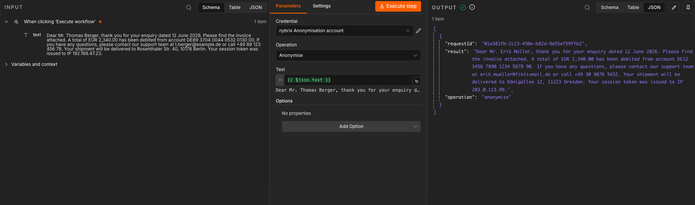
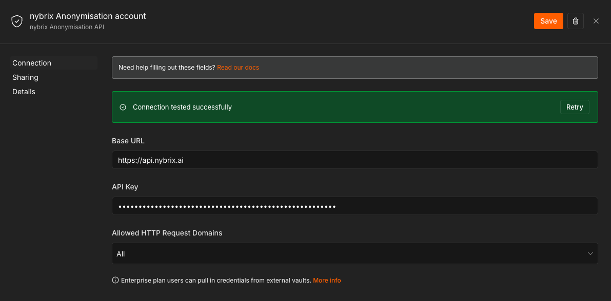
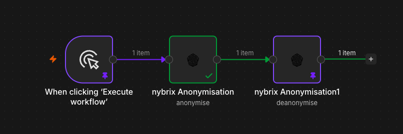
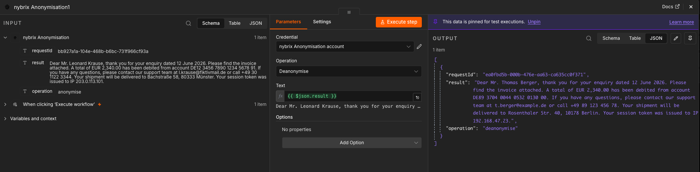

# nybrix Anonymisation

[](https://www.npmjs.com/package/n8n-nodes-nybrix-anonymisation)
[](LICENSE.md)
[](https://docs.n8n.io/integrations/#community-nodes)

Anonymise and deanonymise text in n8n workflows using the **nybrix Anonymisation Pipeline** — AI-powered PII detection with full reversibility.

The nybrix Anonymisation Pipeline detects personally identifiable information (PII) in free-text documents — names, addresses, financial identifiers, and more — and replaces each entity with a consistent synthetic substitute, making documents safe to share, store, or pass to LLMs without violating data protection requirements. The same node can reverse the process, restoring original values on demand via an encrypted server-side mapping table. All data is processed exclusively within the EU.

[n8n](https://n8n.io/) is a [fair-code licensed](https://docs.n8n.io/reference/license/) workflow automation platform.

> **A note on terminology:** "Anonymisation" is used as the common shorthand throughout this node and its documentation. Technically the process is **pseudonymisation** under Art. 4(5) GDPR — the mapping between original and synthetic values is stored server-side and can be reversed. Processed data therefore remains personal data. See [Important Limitations](#important-limitations) for the full legal context.

---

[Installation](#installation) · [Getting Started](#getting-started) · [Operations](#operations) · [Credentials](#credentials) · [Supported PII Categories](#supported-pii-categories) · [Supported Formats](#supported-formats) · [Usage](#usage) · [Options Reference](#options-reference) · [Error Handling](#error-handling) · [Data Privacy & Security](#data-privacy--security) · [Important Limitations](#important-limitations) · [Compatibility](#compatibility) · [Resources](#resources) · [Version History](#version-history)

---

## Installation

### From the n8n UI (recommended)

1. Open your n8n instance
2. Go to **Settings → Community Nodes → Install**
3. Enter `n8n-nodes-nybrix-anonymisation`
4. Click **Install**

This works for n8n Cloud and self-hosted instances running n8n 1.0.0 or later.

### Manual (self-hosted)

```bash
npm install n8n-nodes-nybrix-anonymisation
```

Then restart your n8n instance.

### Development

See [docs/setup.md](docs/setup.md) for the local development workflow (`npm run dev`).

---

## Getting Started

You need a Nikan AI account and an active API key before the node can process any requests.

### 1. Register on the Nikan AI Platform

Create an account at [console.nikan.ai](https://console.nikan.ai).

### 2. Set Up Your Organisation

After registering, create a **Company** profile and add a **User** account linked to it.

### 3. Get Credits

New accounts include a starter token balance. Additional tokens can be purchased at any time through the Key Management Portal. The n8n node itself is free — you only pay for the tokens consumed by the API when processing documents.

### 4. Activate the Product

In the Key Management Portal, activate the **Anonymisation Pipeline** product for your organisation.

### 5. Generate an API Key

Create an API key in the portal. Copy it — you will enter it as a credential in n8n.

> **Important:** Your API key is used to derive the encryption key for your mapping table. If you rotate your API key, previously stored mappings become undecryptable and deanonymisation of older documents will not be possible. Keep your key safe and plan rotations carefully.

### 6. Add the Node to Your Workflow

In n8n, search for **nybrix Anonymisation** in the nodes panel, drag it into your workflow, and configure the credential (see [Credentials](#credentials) below).

---

## Operations

| Operation | Description | Notes |
|---|---|---|
| **Anonymise** | Detects PII in the input text and replaces each entity with a consistent synthetic substitute. Returns a pseudonymised document and a `requestId` for later deanonymisation. | Uses an async queue — the node polls until the result is ready. |
| **Deanonymise** | Restores the original values in a previously pseudonymised document using the encrypted server-side mapping table. | Deterministic DB lookup — no AI involved. Requires the `requestId` from the original anonymise call (pass it as part of the text or workflow context). |

**Output JSON shape**

```json
{
  "requestId": "01a381fb-2c13-450e-b82d-9e55ef59ffb2",
  "result": "Dear Mr. Erik Müller, thank you for your enquiry dated 12 June 2026. ...",
  "operation": "anonymise"
}
```

Store the `requestId` in your workflow if you need to deanonymise the same text later — it links the synthetic substitutes back to the original values on the server.

**Example**

The pipeline replaces each PII entity with a **realistic synthetic substitute** — the document remains fluent and natural, not filled with placeholder tokens.

Input:

```
Dear Mr. Thomas Berger, thank you for your enquiry dated 12 June 2026.
Please find the invoice attached. A total of EUR 2,340.00 has been debited
from account DE89 3704 0044 0532 0130 00. If you have any questions, please
contact our support team at t.berger@example.de or call +49 89 123 456 78.
Your shipment will be delivered to Rosenthaler Str. 40, 10178 Berlin.
Your session token was issued to IP 192.168.47.23.
```

Anonymised `result`:

```
Dear Mr. Erik Müller, thank you for your enquiry dated 12 June 2026.
Please find the invoice attached. A total of EUR 2,340.00 has been debited
from account DE12 3456 7890 1234 5678 90. If you have any questions, please
contact our support team at erik.mueller@fiktivmail.de or call +49 30 9876 5432.
Your shipment will be delivered to Königsallee 12, 11223 Dresden.
Your session token was issued to IP 203.0.113.99.
```



---

## Credentials

The node authenticates with the nybrix Anonymisation API using the **nybrix Anonymisation API** credential type.

**Required fields**

| Field | Description |
|---|---|
| Base URL | The URL of the nybrix Anonymisation API server (pre-filled: `https://api.nybrix.ai`) |
| API Key | Your `X-API-Key` value from the Nikan AI Key Management Portal |

**To configure**

1. In n8n, go to **Credentials → New credential**
2. Search for **nybrix Anonymisation API**
3. Enter the **Base URL** of your deployment
4. Paste your **API Key**
5. Click **Test** — n8n pings the server to verify connectivity
6. Click **Save**

The Base URL is pre-filled with `https://api.nybrix.ai` — no change needed for production use. For local development, replace it with your local server URL (e.g. `http://localhost:8000`).



---

## Supported PII Categories

The AI model detects and pseudonymises the following categories of personal data in free-text documents:

| Category | Examples |
|---|---|
| Identification data | First and last names, pseudonyms, usernames |
| Contact data | Postal addresses, email addresses, phone numbers, fax numbers |
| Financial data | IBAN, credit card numbers, bank account numbers |
| Digital identifiers | IP addresses, user IDs, cookie IDs |

Within a single API call, the same PII entity always maps to the same pseudonym. Across separate calls, consistency is maintained via the server-side mapping table as long as the same API key is used.

---

## Supported Formats

| Format | Input | Output |
|---|---|---|
| Plain text (UTF-8) | ✓ | ✓ |
| Base64-encoded text | ✓ | ✓ |
| JSON (structured fields) | ✓ | ✓ |
| PDF / DOCX (native binary) | — | — |

**Working with PDF and Office documents:** The node processes text input. To anonymise a PDF or Word document, add a text-extraction step before this node in your workflow (e.g., an **Extract from PDF** community node), pass the extracted text to the nybrix Anonymisation node, then optionally repackage the result.

---

## Usage

### Basic anonymise → deanonymise workflow



1. Add a **Manual Trigger** node
2. Add a **nybrix Anonymisation** node — set **Operation** to `Anonymise` and **Text** to your input (or `{{ $json.text }}` from an upstream node)
3. Add a second **nybrix Anonymisation** node — set **Operation** to `Deanonymise` and **Text** to `{{ $json.result }}`
4. Execute — the second node's `result` will match the original input exactly



### Using the node as an AI Agent tool

The node has `usableAsTool: true`, which means it can be attached to an **AI Agent** node in n8n as a callable tool. The agent can invoke anonymisation on any text before passing it to an LLM, ensuring sensitive data never reaches external model providers. After the LLM call, the agent can deanonymise the response to restore original values — a complete privacy-preserving LLM pipeline.

### Language support and accuracy

- **English** is the primary language with the highest detection accuracy
- **German** is supported in beta
- Other languages are experimental — detection quality may vary
- Detection quality may also be lower on very short texts, tabular data, or highly structured content such as source code

---

## Options Reference

Open the **Options** section in the node to configure polling behaviour:

| Option | Default | Description |
|---|---|---|
| Max Retries | `60` | Maximum number of status polls before the node times out |
| Polling Interval (Ms) | `1000` | Milliseconds to wait between status polls |

**Timeout** = `maxRetries × pollingInterval ÷ 1000` seconds. The default is 60 × 1,000 ms = **60 seconds**.

For long documents or high server load, increase **Max Retries** and/or **Polling Interval**.

---

## Error Handling

### Continue on Fail

Enable **Continue on Fail** in the node settings (the gear icon) to prevent a single failed item from stopping the entire workflow. Failed items will include an `error` field instead of a `result`:

```json
{ "error": "Authentication failed. Check your API key." }
```

### Error conditions

| Message | Cause | Resolution |
|---|---|---|
| `Authentication failed. Check your API key.` | Invalid or missing API key | Verify your credential in n8n |
| `API key quota exceeded.` | Token balance exhausted | Recharge credits at console.nikan.ai or contact support@nikan.ai |
| `Request ID not found on server.` | Job expired before result was retrieved | Reduce polling interval or retry the full operation |
| `Transformation timed out after N attempts` | Server took longer than the configured timeout | Increase Max Retries or Polling Interval in Options |

---

## Data Privacy & Security

| Parameter | Details |
|---|---|
| GDPR role of provider | Data Processor (Art. 28 GDPR) — customers are the data controllers |
| Processing location | EU only — Scaleway, Paris, France (ISO 27001-certified data centre) |
| Third-country transfers | None — all data stays in the EEA |
| Mapping table retention | Stored persistently (encrypted) to enable deanonymisation; deleted on request by the controller; backup propagation within 24 h |
| Input / output retention | Input and intermediate files: deleted immediately after processing. Output: deleted after 24 h |
| Sub-processors | Scaleway S.A.S. (hosting + database), Scaleway AI LLM Endpoint — full list in DPA Annex 3 |
| AI training with customer data | **Explicitly prohibited** — customer data is never used for model training |
| Transport encryption | TLS 1.3 for all connections |
| Encryption at rest | Fernet (AES-128-CBC + HMAC-SHA256), key derived from the organisation's API key |

A Data Processing Agreement (DPA) in accordance with Art. 28 GDPR must be concluded before productive use. All compliance documents are available at [nikan.ai](https://nikan.ai).

---

## Important Limitations

- **Pseudonymisation, not anonymisation:** The output is pseudonymised data under Art. 4(5) GDPR — *not* anonymised data under Recital 26. As long as the mapping table exists on the server, the processed data remains personal data. This product does not replace a Data Protection Impact Assessment (DPIA) by the data controller.

- **Probabilistic AI detection:** There is no guarantee of complete or error-free detection of all PII entities. False negatives (missed PII) and false positives (non-PII flagged as PII) can occur. For workflows involving special-category data (Art. 9 GDPR), a human reviewer is mandatory.

- **Prohibited use cases:** The product must not be used in high-risk AI contexts under Annex III of the EU AI Act — including employment, education, creditworthiness assessment, law enforcement, migration, justice, critical infrastructure, or biometrics. Medical or pharmaceutical research with patient data requires a separate written agreement.

- **One API key per controller:** Multi-controller pooling under a single API key is not permitted. Each data controller must use their own API key and sign their own Data Processing Agreement.

- **API key rotation:** Rotating your API key will make previously stored mapping entries undecryptable. Plan key rotations carefully and ensure all active pseudonymised documents are deanonymised beforehand.

---

## Compatibility

- **Minimum n8n version:** 1.0.0
- **Tested against:** n8n 1.x
- **Node.js:** v22 or higher (for local development)
- **n8n Nodes API version:** 1

Compatible with n8n Cloud, self-hosted deployments, and the local development server (`npm run dev`).

---

## Resources

- [Nikan AI Key Management Portal](https://console.nikan.ai)
- [Compliance Documents (DPA, Privacy Policy, EULA)](https://nikan.ai)
- [Support: support@nikan.ai](mailto:support@nikan.ai)
- [Security incidents: security@nikan.ai](mailto:security@nikan.ai)
- [n8n Community Nodes documentation](https://docs.n8n.io/integrations/#community-nodes)

**Developer documentation** (this repo):

- [Setup guide](docs/setup.md)
- [API reference](docs/api-reference.md)
- [Architecture](docs/architecture.md)
- [Internals deep-dive](docs/internals.md)
- [Testing guide](docs/testing.md)
- [Certification checklist](docs/certification.md)

---

## Version History

| Version | Date | Changes |
|---|---|---|
| 0.1.0 | 2026-06 | Initial release — Anonymise and Deanonymise operations over the nybrix Anonymisation API (JSON-RPC 2.0 / StreamableHttp transport) |

---

## License

[MIT](LICENSE.md)
